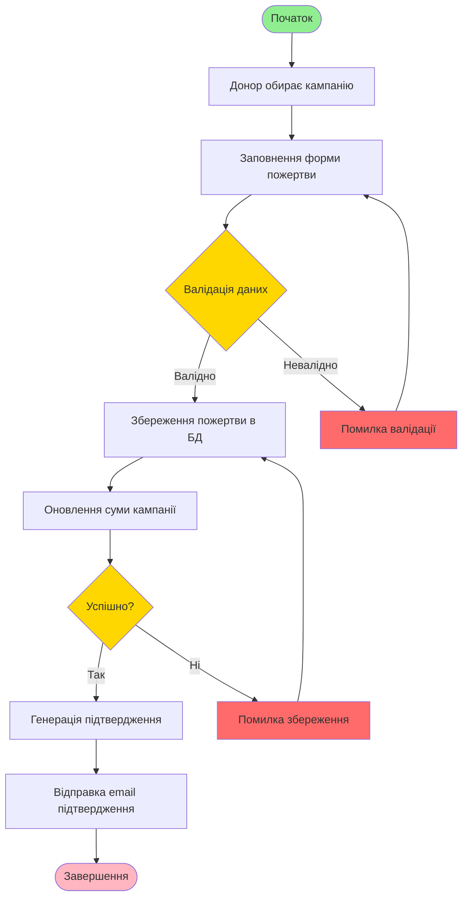

# BPMN Модель процесу "Обробка пожертви"

```mermaid
graph TB
    Start([Початок])
    Task1[Донор обирає кампанію]
    Task2[Заповнення форми пожертви]
    Gateway1{Валідація даних}
    Task3[Збереження пожертви в БД]
    Task4[Оновлення суми кампанії]
    Task5[Генерація підтвердження]
    Task6[Відправка email підтвердження]
    End([Завершення])
    
    Error1[Помилка валідації]
    Error2[Помилка збереження]
    
    Start --> Task1
    Task1 --> Task2
    Task2 --> Gateway1
    
    Gateway1 -->|Валідно| Task3
    Gateway1 -->|Невалідно| Error1
    Error1 --> Task2
    
    Task3 --> Task4
    Task4 --> Gateway2{Успішно?}
    
    Gateway2 -->|Так| Task5
    Gateway2 -->|Ні| Error2
    Error2 --> Task3
    
    Task5 --> Task6
    Task6 --> End
    
    style Start fill:#90EE90
    style End fill:#FFB6C1
    style Gateway1 fill:#FFD700
    style Gateway2 fill:#FFD700
    style Error1 fill:#FF6B6B
    style Error2 fill:#FF6B6B
```

