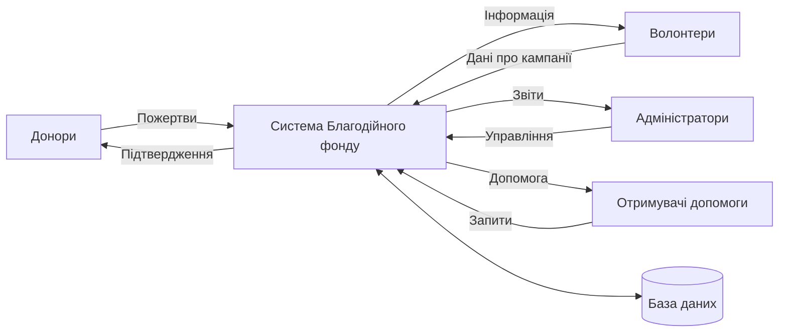
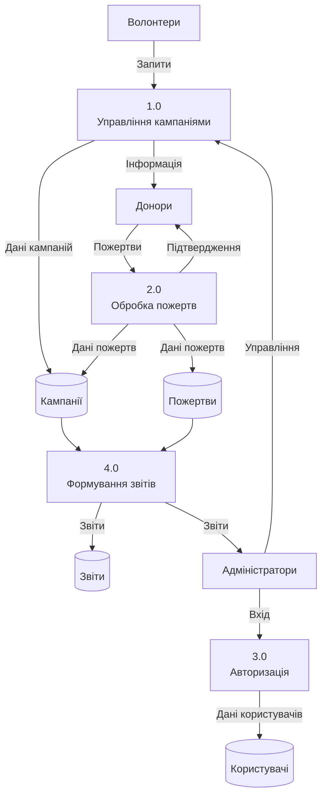

# DFD Діаграми

## DFD Рівень 0 - Контекстна діаграма

```mermaid
graph LR
    External1[Донори]
    External2[Волонтери]
    External3[Адміністратори]
    External4[Отримувачі допомоги]
    
    System[Система Благодійного фонду]
    
    External1 -->|Пожертви| System
    External2 -->|Дані про кампанії| System
    External3 -->|Управління| System
    External4 -->|Запити| System
    
    System -->|Підтвердження| External1
    System -->|Інформація| External2
    System -->|Звіти| External3
    System -->|Допомога| External4
    
    DB[(База даних)]
    System <--> DB
```

## DFD Рівень 1 - Декомпозиція системи

```mermaid
graph TB
    Process1[1.0<br/>Управління кампаніями]
    Process2[2.0<br/>Обробка пожертв]
    Process3[3.0<br/>Авторизація]
    Process4[4.0<br/>Формування звітів]
    
    External1[Донори] -->|Пожертви| Process2
    External2[Волонтери] -->|Запити| Process1
    External3[Адміністратори] -->|Управління| Process1
    External3 -->|Вхід| Process3
    
    Process2 -->|Дані пожертв| DB1[(Кампанії)]
    Process1 -->|Дані кампаній| DB1
    Process3 -->|Дані користувачів| DB2[(Користувачі)]
    Process2 -->|Дані пожертв| DB3[(Пожертви)]
    Process4 -->|Звіти| DB4[(Звіти)]
    
    Process1 -->|Інформація| External1
    Process2 -->|Підтвердження| External1
    Process4 -->|Звіти| External3
    
    DB1 --> Process4
    DB3 --> Process4
```

