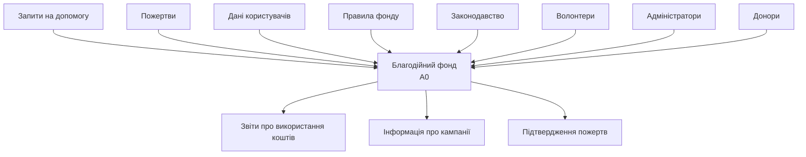
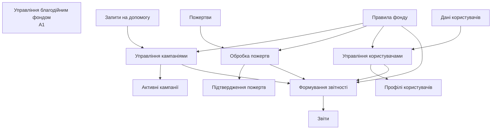

# IDEF0 Діаграми

## Рівень A0 - Контекстна діаграма

```mermaid
graph TB
    A0[Благодійний фонд<br/>A0]
    
    Input1[Запити на допомогу]
    Input2[Пожертви]
    Input3[Дані користувачів]
    
    Output1[Звіти про використання коштів]
    Output2[Інформація про кампанії]
    Output3[Підтвердження пожертв]
    
    Control1[Правила фонду]
    Control2[Законодавство]
    
    Mechanism1[Волонтери]
    Mechanism2[Адміністратори]
    Mechanism3[Донори]
    
    Input1 --> A0
    Input2 --> A0
    Input3 --> A0
    
    A0 --> Output1
    A0 --> Output2
    A0 --> Output3
    
    Control1 --> A0
    Control2 --> A0
    
    Mechanism1 --> A0
    Mechanism2 --> A0
    Mechanism3 --> A0
```

## Рівень A1 - Декомпозиція A0

```mermaid
graph TB
    A1[Управління благодійним фондом<br/>A1]
    
    A11[Управління кампаніями]
    A12[Обробка пожертв]
    A13[Управління користувачами]
    A14[Формування звітності]
    
    Input1[Запити на допомогу] --> A11
    Input2[Пожертви] --> A12
    Input3[Дані користувачів] --> A13
    
    A11 --> Output1[Активні кампанії]
    A12 --> Output2[Підтвердження пожертв]
    A13 --> Output3[Профілі користувачів]
    A14 --> Output4[Звіти]
    
    A11 --> A14
    A12 --> A14
    A13 --> A14
    
    Control1[Правила фонду] --> A11
    Control1 --> A12
    Control1 --> A13
    Control1 --> A14
```

