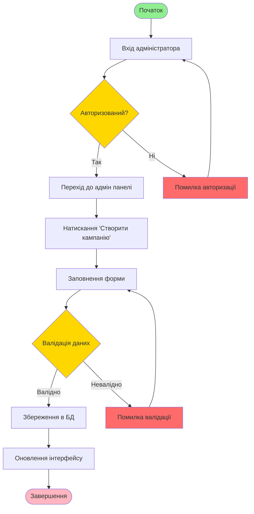

# UML Activity Діаграма - Створення кампанії

```mermaid
graph TB
    Start([Початок])
    Login[Вхід адміністратора]
    CheckAuth{Авторизований?}
    Navigate[Перехід до адмін панелі]
    ClickCreate[Натискання 'Створити кампанію']
    FillForm[Заповнення форми]
    Validate{Валідація даних}
    Save[Збереження в БД]
    UpdateUI[Оновлення інтерфейсу]
    End([Завершення])
    
    Error1[Помилка авторизації]
    Error2[Помилка валідації]
    
    Start --> Login
    Login --> CheckAuth
    CheckAuth -->|Так| Navigate
    CheckAuth -->|Ні| Error1
    Error1 --> Login
    
    Navigate --> ClickCreate
    ClickCreate --> FillForm
    FillForm --> Validate
    
    Validate -->|Валідно| Save
    Validate -->|Невалідно| Error2
    Error2 --> FillForm
    
    Save --> UpdateUI
    UpdateUI --> End
    
    style Start fill:#90EE90
    style End fill:#FFB6C1
    style CheckAuth fill:#FFD700
    style Validate fill:#FFD700
    style Error1 fill:#FF6B6B
    style Error2 fill:#FF6B6B
```

