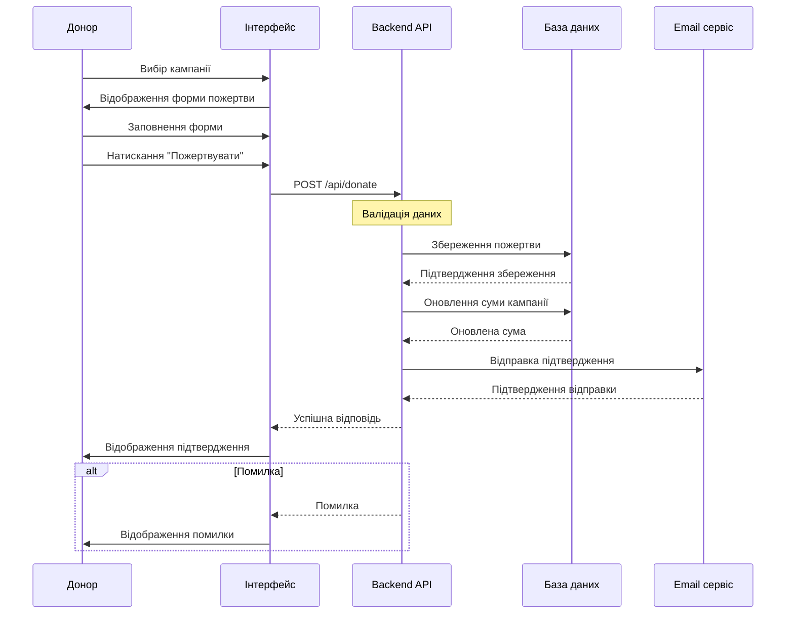

# UML Sequence Діаграма - Процес переказу коштів

```mermaid
sequenceDiagram
    participant D as Донор
    participant UI as Інтерфейс
    participant API as Backend API
    participant DB as База даних
    participant Email as Email сервіс
    
    D->>UI: Вибір кампанії
    UI->>D: Відображення форми пожертви
    D->>UI: Заповнення форми
    D->>UI: Натискання "Пожертвувати"
    
    UI->>API: POST /api/donate
    Note over API: Валідація даних
    API->>DB: Збереження пожертви
    DB-->>API: Підтвердження збереження
    
    API->>DB: Оновлення суми кампанії
    DB-->>API: Оновлена сума
    
    API->>Email: Відправка підтвердження
    Email-->>API: Підтвердження відправки
    
    API-->>UI: Успішна відповідь
    UI->>D: Відображення підтвердження
    
    alt Помилка
        API-->>UI: Помилка
        UI->>D: Відображення помилки
    end
```

