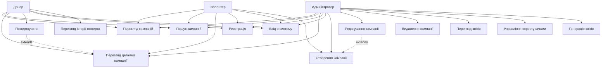

# UML Use Case Діаграма

```mermaid
graph TB
    Actor1[Донор]
    Actor2[Волонтер]
    Actor3[Адміністратор]
    
    UC1[Перегляд кампаній]
    UC2[Пошук кампаній]
    UC3[Перегляд деталей кампанії]
    UC4[Пожертвувати]
    UC5[Реєстрація]
    UC6[Вхід в систему]
    UC7[Перегляд історії пожертв]
    UC8[Створення кампанії]
    UC9[Редагування кампанії]
    UC10[Видалення кампанії]
    UC11[Перегляд звітів]
    UC12[Управління користувачами]
    UC13[Генерація звітів]
    
    Actor1 --> UC1
    Actor1 --> UC2
    Actor1 --> UC3
    Actor1 --> UC4
    Actor1 --> UC5
    Actor1 --> UC6
    Actor1 --> UC7
    
    Actor2 --> UC1
    Actor2 --> UC2
    Actor2 --> UC3
    Actor2 --> UC5
    Actor2 --> UC6
    Actor2 --> UC8
    
    Actor3 --> UC1
    Actor3 --> UC2
    Actor3 --> UC3
    Actor3 --> UC5
    Actor3 --> UC6
    Actor3 --> UC8
    Actor3 --> UC9
    Actor3 --> UC10
    Actor3 --> UC11
    Actor3 --> UC12
    Actor3 --> UC13
    
    UC4 -.->|extends| UC3
    UC9 -.->|extends| UC8
```

